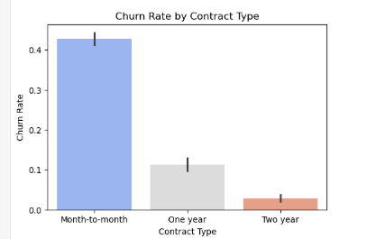

# Predictive Churn Modeling & Risk Mitigation
**Developed by: Navis Zuhud**

## Project Overview
This project utilizes Machine Learning to predict customer turnover for a telecommunications provider. By identifying key risk markers, the model allows businesses to intervene before a customer cancels their service.

## Key Features & Insights
- Data Exploration: Analyzed features like tenure, contract type, and monthly charges to find correlations with churn.
- Model Performance: Developed a classification model to predict at-risk users.
- Risk Factors: Identified that Month-to-Month contracts and high Fiber Optic charges were the primary drivers of churn.
- Business Strategy: Recommended targeted discount campaigns for high-risk segments to improve retention.

## Visual Output Sample

## Tech Stack
- Language: Python
- Libraries: Pandas, Scikit-Learn, Matplotlib, Seaborn
- Technique: Supervised Learning (Classification)
